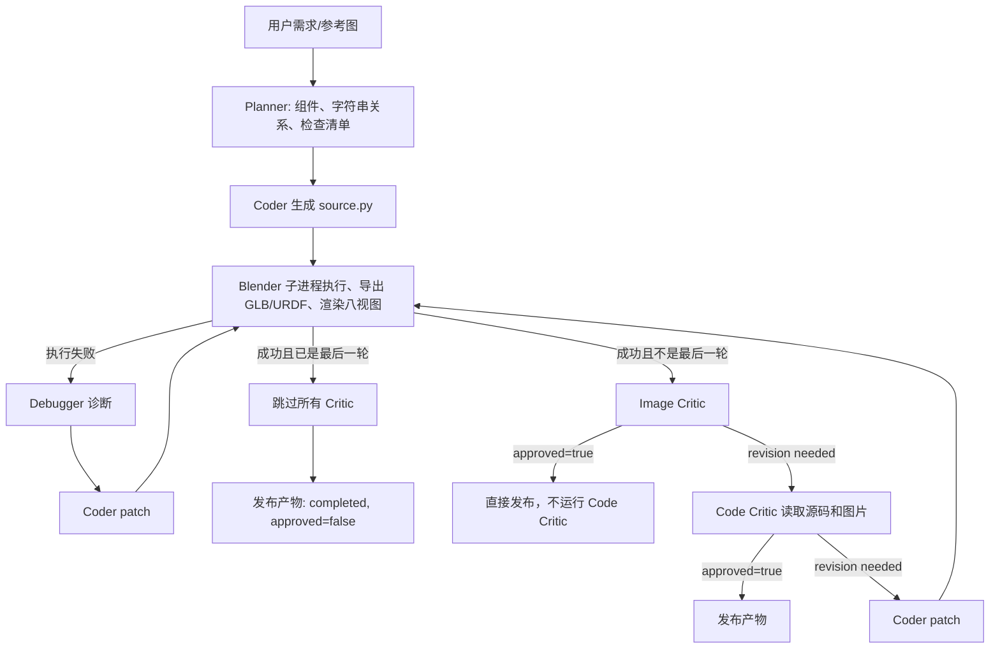

# aDSL Agent 流程与生成模型缺陷审计

- 审计日期：2026-08-31
- Verification Status：**ANALYZED**
- 范围：12 个逻辑 case、15 次 Agent 调用
- 原始产物：`temp/audit_20260830/`
- 结论性质：定向诊断，不是论文完整 benchmark，也不能支持统计性 SOTA 结论

## 1. 核心结论

当前流程已经能够稳定生成可打开的 `source.py`、GLB、URDF 和八视图 PNG，但它还不能稳定证明生成结果正确。

15 次调用全部产出了文件，其中 14 次被当前流程批准；这个 `14/15` 是 Agent 自身的审批结果，不是独立评测成功率。现有证据中已经出现：

1. 明确的需求未满足却被批准，例如 T04 的杯内壁和底面始终不可见。
2. 三个已批准资产包含真实的 non-watertight 或退化几何。
3. articulated case 只渲染初始姿态，没有在正式流程中验证全行程、运动方向和碰撞。
4. 最后一次执行不经过 Critic，仍可被发布为 `completed`。
5. 模型生成的 Python 以当前 root 权限直接执行，没有真正的安全沙箱。

因此，更准确的判断是：**生成链路可用，结构化 DSL 对部分关系任务有效，但审批闭环、动态验证、安全边界和高保真能力尚不可靠。**

## 2. 当前 Agent 的实际决策逻辑

这套流程有四个关键问题。

### 2.1 最后一轮必定没有 Critic

`service.py` 在执行成功后先判断是否到达 `end_round`。如果是，就直接设置：

- `approved=false`
- `critic_skipped=true`
- `finalization_reason=round_limit_after_execution`

随后仍然 publish，并把运行状态写为 `completed`。T01-one-round-control 是直接控制证据：`max_rounds=1` 时成功生成了可用椅子，但完全没有 Image/Code Critic 记录。

这意味着一个 round 并不完整地表示“生成 + 审查”；最后一个预算实际上只能执行，不能验证。

### 2.2 Image Critic 可以绕过 Code Critic

只要 Image Critic 返回 `approved=true`，流程立即结束。15 次调用中：

- 12 次由 Image Critic 直接批准；
- 2 次由 Code Critic 批准；
- 1 次完全跳过 Critic；
- Code Critic 只出现在 5 次调用中，共做出 6 次决策。

因此，源码结构、精确计数、拓扑、关节和隐藏关系并没有得到稳定覆盖。

### 2.3 两个 Critic 存在循环信任

Image Critic prompt 要求：收到 Code Critic 结论时，将其视为权威；视觉印象与代码结论冲突时服从 Code Critic。

Code Critic prompt 又要求：以 Coder 源码为主要依据，并且 `MUST TRUST THE CODE LOGIC`。

这会把“代码表达了某个意图”错误提升为“执行后的模型和图片已经满足需求”。T04 正是这种假阳性：代码确实写了 cavity，但最终图片没有显示用户要求的内部和底面，流程仍批准。

### 2.4 Planner 约束不是机器可执行约束

Planner 的 `relations` 和 `critic_checklist` 主要是 `list[str]`，没有绑定以下确定性检查：

- exact component count；
- 接触距离和容差；
- 对齐轴和间距；
- watertight/退化面；
- joint lower/mid/upper 状态；
- 碰撞和穿模。

目前所谓“constraint satisfaction”大部分仍是 LLM 对自然语言和图片的主观判断。

## 3. 严重度分级

| 级别 | 缺陷 | 是否已在 case 中触发 | 影响 |
|---|---|---|---|
| P0 | root 权限直接执行模型生成 Python，无真正沙箱 | 未发现恶意代码，但执行路径真实存在 | 可能读取/修改文件、访问网络或启动子进程 |
| P0 | 审批存在假阳性和末轮跳过 | T04、T01-one-round-control | `approved/completed` 不能代表需求满足 |
| P0 | articulated 没有动态验证闭环 | A01、I02、A02 | 无法证明全行程、运动方向和无碰撞 |
| P1 | 没有确定性 topology gate | T02、T04、M01 scratch | 仿真、碰撞、制造或后处理可能失败 |
| P1 | 固定相机不适合容器和室内场景 | T04、S01，部分影响 T02 | 关键结构不可见，Critic 仍可能批准 |
| P1 | 没有 AST/compile preflight | I01、I02、M01 scratch | 相同低级语法错误反复消耗 Blender 和 Agent token |
| P1 | 高保真材质/纹理能力不足 | I01、I02、T05、A02、M01 系列 | 与参考图或论文展示质量差距明显 |
| P2 | 成功执行日志没有按轮完整持久化 | 全局 | Blender warning 和成功路径问题难以追踪 |
| P2 | 会话反复内嵌相同 PNG | 多轮 Critic case | SQLite 体积和上下文成本持续增加 |

这里的 topology 问题对普通静态图片不一定立即致命，但对物理仿真、碰撞检测、制造、mesh repair 和继续编辑可能是致命问题。

## 4. 逐模型产物与问题

下表中的 GLB、八视图、源码和运行记录均为原始审计产物，可直接用于复查。

| Invocation | 生成模型 | 当前审批 | 人工结论 | 主要问题 | 证据 |
|---|---|---|---|---|---|
| T01-main | 四腿、三横档餐椅 | Image Critic approved | 较好 | 精确数量、接触和无扶手均满足；仍混用较多手写绝对坐标 | [GLB](../../temp/audit_20260830/T01-main/scene.glb) · [八视图](../../temp/audit_20260830/T01-main/contact_sheet.jpg) · [源码](../../temp/audit_20260830/T01-main/source.py) · [run](../../temp/audit_20260830/T01-main/run.json) |
| T01-one-round-control | 同需求餐椅 | 未批准，Critic skipped | 模型可用，流程失败 | `max_rounds=1` 时没有任何 Critic；仍以 completed 发布 | [GLB](../../temp/audit_20260830/T01-one-round-control/scene.glb) · [八视图](../../temp/audit_20260830/T01-one-round-control/contact_sheet.jpg) · [源码](../../temp/audit_20260830/T01-one-round-control/source.py) · [run](../../temp/audit_20260830/T01-one-round-control/run.json) |
| T02-bookshelf | 四层深红书架和书本 | Image Critic approved | 部分成功 | 第一轮书本浮空被修复；曲面前沿不明显；4 个 CSG 货架网格 non-watertight，共 41 个退化面 | [GLB](../../temp/audit_20260830/T02-bookshelf/scene.glb) · [八视图](../../temp/audit_20260830/T02-bookshelf/contact_sheet.jpg) · [源码](../../temp/audit_20260830/T02-bookshelf/source.py) · [run](../../temp/audit_20260830/T02-bookshelf/run.json) |
| T03-radial-wheel | 16 辐条轮 | Image Critic approved | 强正例 | 16 根等角辐条、hub/rim 接触在源码与视觉中都成立；主要不足是外形仍很 primitive | [GLB](../../temp/audit_20260830/T03-radial-wheel/scene.glb) · [八视图](../../temp/audit_20260830/T03-radial-wheel/contact_sheet.jpg) · [源码](../../temp/audit_20260830/T03-radial-wheel/source.py) · [run](../../temp/audit_20260830/T03-radial-wheel/run.json) |
| T04-hollow-mug | 中空杯和 C 形把手 | Code Critic approved | 明确假阳性 | 源码有 cavity，但两轮八视图都看不到杯内壁/底面；把手粗糙且 non-watertight，Euler characteristic 为 -7 | [GLB](../../temp/audit_20260830/T04-hollow-mug/scene.glb) · [八视图](../../temp/audit_20260830/T04-hollow-mug/contact_sheet.jpg) · [源码](../../temp/audit_20260830/T04-hollow-mug/source.py) · [run](../../temp/audit_20260830/T04-hollow-mug/run.json) |
| T05-patterned-desk | 黑白斜纹桌、抽屉和侧板 | Image Critic approved | 结构成功，外观较弱 | 条纹由 13 个薄 Cube 与 boolean 模拟，不是真正 texture/material；低视角几乎看不到图案 | [GLB](../../temp/audit_20260830/T05-patterned-desk/scene.glb) · [八视图](../../temp/audit_20260830/T05-patterned-desk/contact_sheet.jpg) · [源码](../../temp/audit_20260830/T05-patterned-desk/source.py) · [run](../../temp/audit_20260830/T05-patterned-desk/run.json) |
| I01-example-image | 参考图木桌重建 | Image Critic approved | 语义可辨，保真度低 | 桌面/围板偏厚、腿型和比例粗化、无木纹；第一轮出现非法 `0. thirty` | [GLB](../../temp/audit_20260830/I01-example-image/scene.glb) · [八视图](../../temp/audit_20260830/I01-example-image/contact_sheet.jpg) · [源码](../../temp/audit_20260830/I01-example-image/source.py) · [run](../../temp/audit_20260830/I01-example-image/run.json) |
| I02-example-arti | 三抽屉可动床头柜 | Image Critic approved | 结构推断较好，视觉粗糙 | 3 个 prismatic joints 合理；接缝过大、把手过细、材质平；第一轮出现非法 `0. forty`；原流程没有渲染抽屉打开状态 | [GLB](../../temp/audit_20260830/I02-example-arti/scene.glb) · [八视图](../../temp/audit_20260830/I02-example-arti/contact_sheet.jpg) · [源码](../../temp/audit_20260830/I02-example-arti/source.py) · [URDF](../../temp/audit_20260830/I02-example-arti/scene.urdf) · [run](../../temp/audit_20260830/I02-example-arti/run.json) |
| A01-cabinet | 双门加抽屉柜 | Code Critic approved | 关节定义可用，验证不足 | 2 revolute + 1 prismatic 静态定义合理；原八视图全部关闭，Code Critic 仅凭代码批准，无轨迹碰撞证据 | [GLB](../../temp/audit_20260830/A01-cabinet/scene.glb) · [八视图](../../temp/audit_20260830/A01-cabinet/contact_sheet.jpg) · [源码](../../temp/audit_20260830/A01-cabinet/source.py) · [URDF](../../temp/audit_20260830/A01-cabinet/scene.urdf) · [run](../../temp/audit_20260830/A01-cabinet/run.json) |
| A02-faucet | 双旋钮和中央 lever | Image Critic approved | 修复有效，语义较弱 | 3 个 revolute joints 可用；第二轮修复 floating support；整体更像工业塔，faucet 造型与小控件运动不够清晰 | [GLB](../../temp/audit_20260830/A02-faucet/scene.glb) · [八视图](../../temp/audit_20260830/A02-faucet/contact_sheet.jpg) · [源码](../../temp/audit_20260830/A02-faucet/source.py) · [URDF](../../temp/audit_20260830/A02-faucet/scene.urdf) · [run](../../temp/audit_20260830/A02-faucet/run.json) |
| E01-chair-slat-edit | 椅背 3→5 横档编辑 | Image Critic approved | 最干净的编辑正例 | 只改变横档数量和间距，座面、四腿和立柱保持；没有明显致命问题 | [GLB](../../temp/audit_20260830/E01-chair-slat-edit/scene.glb) · [八视图](../../temp/audit_20260830/E01-chair-slat-edit/contact_sheet.jpg) · [源码](../../temp/audit_20260830/E01-chair-slat-edit/source.py) · [run](../../temp/audit_20260830/E01-chair-slat-edit/run.json) |
| S01-living-room | 沙发、桌、TV、灯和地毯场景 | Image Critic approved | 关系大致满足，观察协议失败 | 五项空间关系基本成立；约 3/8 视图主要被不透明墙遮挡；场景 primitive 化严重 | [GLB](../../temp/audit_20260830/S01-living-room/scene.glb) · [八视图](../../temp/audit_20260830/S01-living-room/contact_sheet.jpg) · [源码](../../temp/audit_20260830/S01-living-room/source.py) · [run](../../temp/audit_20260830/S01-living-room/run.json) |
| M01-base-motorcycle | 基础摩托车 | Image Critic approved | 可辨识基体 | 两轮、车架、座椅和前叉可辨；材质与机械细节较简化 | [GLB](../../temp/audit_20260830/M01-base-motorcycle/scene.glb) · [八视图](../../temp/audit_20260830/M01-base-motorcycle/contact_sheet.jpg) · [源码](../../temp/audit_20260830/M01-base-motorcycle/source.py) · [run](../../temp/audit_20260830/M01-base-motorcycle/run.json) |
| M01-cyberpunk-edit | 基于 memory 的赛博朋克编辑 | Image Critic approved | 保留身份，但风格增强较弱 | 保留原摩托车较好；改动偏“贴片式”，视觉不如 scratch 统一；2 轮、15 请求、123,800 tokens，源码膨胀 +99/-3 行 | [GLB](../../temp/audit_20260830/M01-cyberpunk-edit/scene.glb) · [八视图](../../temp/audit_20260830/M01-cyberpunk-edit/contact_sheet.jpg) · [源码](../../temp/audit_20260830/M01-cyberpunk-edit/source.py) · [run](../../temp/audit_20260830/M01-cyberpunk-edit/run.json) |
| M01-cyberpunk-scratch | 从零生成赛博朋克摩托车 | Image Critic approved | 风格更统一，存在几何错误 | 赛博朋克特征比 edit 明显；第一轮有 `0. thirty` 语法错误；power-unit CSG non-watertight、2 个退化面、3 个连通分量 | [GLB](../../temp/audit_20260830/M01-cyberpunk-scratch/scene.glb) · [八视图](../../temp/audit_20260830/M01-cyberpunk-scratch/contact_sheet.jpg) · [源码](../../temp/audit_20260830/M01-cyberpunk-scratch/source.py) · [run](../../temp/audit_20260830/M01-cyberpunk-scratch/run.json) |

摩托车三者的并排对比见 [M01-comparison.jpg](../../temp/audit_20260830/M01-comparison.jpg)。

## 5. 对模型缺陷的详细解释

### 5.1 T02：关系修复有效，但几何验证缺位

第一轮把书本放到整个 curved shelf 的 AABB 顶面。较高的前沿装饰被错误当作支撑面，造成书本浮空。Code Critic 识别后，第二轮改为把书本放到 `shelf.board`，这是 iterative repair 的正面证据。

但最终四个 `board + nosing` boolean union 都不是 watertight，并包含 41 个 zero-area faces。Agent 只检查了图片和代码，没有读取 mesh topology，所以仍然批准。这说明关系算子能改善“放在哪里”，但不能保证 CSG 产物有效。

### 5.2 T04：代码意图不能代替最终视觉证据

杯体通过 outer cylinder 减去 cavity cylinder，程序层面确实存在开口、壁厚和杯底。问题是需求包含 **visible wall thickness / hollow interior**，最终八视图却始终无法看清内部。

Image Critic 两次都捕捉到这一问题。第二轮并没有修改 cavity 或相机，只调整了把手连接位置；Code Critic 最终依据代码中的 boolean cavity 将视觉问题归类为相机误解并批准。这个 case 证明当前流程会把：

> “源码想表达中空”

错误等同于：

> “执行结果已经向用户证明它中空且内部可见”。

此外，杯体 mesh 本身闭合，但多段 cylinder/sphere 合并的把手仍 non-watertight。

### 5.3 A01/I02/A02：能运动不等于已被 Agent 验证

审计阶段另行生成了 85% joint pose：

- [I02 pose](../../temp/audit_20260830/pose_probes/I02-example-arti/contact_sheet.jpg)
- [A01 pose](../../temp/audit_20260830/pose_probes/A01-cabinet/contact_sheet.jpg)
- [A02 pose](../../temp/audit_20260830/pose_probes/A02-faucet/contact_sheet.jpg)

这些 probe 支持关节 API 和生成源码确实能改变姿态，但不能弥补正式流程的验证缺口：

- 原 Critic 没有收到 pose 图片；
- 所有关节被同时设为约 85%，不是逐关节采样；
- 没有 lower/middle/upper 状态；
- 没有连续轨迹或 mesh collision 检查。

因此可以说“这些关节静态定义和单个外部 probe 基本可用”，不能说“Agent 已证明全行程正确且无碰撞”。

### 5.4 图片重建：语义识别优于外观复原

I01 和 I02 都能从参考图恢复基本类别与组成，I02 甚至能推断三个抽屉使用 prismatic joints，这是有价值的结果。但输出仍主要由简单 Cube/Cylinder 和 flat RGB 材质组成：

- 比例、腿型、围板和接缝被粗化；
- 没有木纹、roughness、normal 或高频细节；
- 把手和结构连接缺乏真实感；
- fixed orbit 也没有严格匹配参考图视角。

因此当前主流程更适合生成“可解释的结构草模”，不适合直接宣称高保真 image-to-3D reconstruction。

### 5.5 Memory edit：保持身份有效，效率和视觉优势不稳定

M01 edit 相比 scratch：

| 指标 | Edit with memory | Scratch |
|---|---:|---:|
| 轮次 | 2 | 2 |
| wall time | 256.868 s | 325.917 s |
| requests | 15 | 11 |
| tokens | 123,800 | 91,806 |
| 执行失败 | 0 | 1 |

memory edit 快约 69 秒，能很好保留原摩托车身份，也避开了 scratch 的首轮语法错误；但它用了更多请求和 tokens，源码更长，赛博朋克风格反而弱于 scratch。

这支持“程序化 memory 有利于局部保持”，但不支持“必然减少轮次/token 或提升视觉质量”的普遍结论。

## 6. 执行、日志和成本问题

### 6.1 重复语法污染

I01、I02、M01 scratch 首轮分别出现 `0. thirty`、`0. forty` 等非法 Python。三次 debugger/debugger_patch 合计消耗：

- 136,787 tokens，约占全部 836,614 tokens 的 16.4%；
- 18 次模型请求，约占全部 118 次请求的 15.3%。

这类错误应当在 Blender 启动前通过 `ast.parse` 和 `compile` 返回给当前 Coder，不应启动完整执行器和独立 Debugger Agent。

### 6.2 成功日志缺失

`ExecutionResult` 会捕获 stdout/stderr，但当前 service 没有为每轮成功执行持久化完整日志。失败 stderr 会进入 `run.json`，成功但带 Blender/导出 warning 的情况却难以追踪。

最低要求应当是每轮保留：

- `executor.stdout.log`
- `executor.stderr.log`
- Blender 版本、渲染设备、engine、samples 和分辨率
- GLB/URDF/export warning
- subprocess exit code、峰值内存和 wall time

### 6.3 图片和 SQLite 重复存储

按会话消息解析，本轮共有 198 个内嵌 `data:image`，其中 52 个是重复内容，重复出现占约 26.3%。角色会话隔离存在，但没有 content-addressed 图片引用或数据库 pruning，多轮 Image/Code Critic 会反复存储同一组八视图。

### 6.4 GPU 不解决这些正确性问题

GPU Eevee 队列可以缩短渲染时间并通过串行/显存锁避免 OOM，但它不会修复：

- 错误的审批控制流；
- 不可执行的字符串约束；
- topology、contact 或 collision 验证缺失；
- 固定相机看不到关键部件；
- 任意 Python 的 root 执行风险。

因此 GPU 优化应当与正确性验证分开评价。

## 7. 与论文效果之间仍缺少的证据

本轮不能视为论文完整复现，原因包括：

1. 使用的是本机 Stepcode `gpt-5.6-sol` profile，不是论文报告的相同模型设置。
2. 审计 case 使用 512×512、16 samples 的诊断渲染，而不是论文高质量评测渲染协议。
3. 没有完成论文规模的 text/image/edit benchmark。
4. 没有 CLIP、VQA、FID、执行率、用户研究和基线对比。
5. 没有复现论文高保真 SpaceControl/Trellis 阶段。
6. 当前 primitive/flat-material 输出不能等价替代论文展示的高频细节结果。

因此当前证据能支持的是：

- DSL 对精确重复、部分空间关系和局部程序编辑有价值；
- Agent 能生成可执行、可导出、可渲染的结构草模；
- 迭代 critic 有时能修复关系错误。

当前证据不能支持的是：

- 14/15 的独立真实成功率；
- articulated 全行程正确、无碰撞；
- mesh 普遍有效或 watertight；
- 与参考图高保真一致；
- 已达到论文 benchmark 或论文整体效果。

## 8. 建议修复顺序

### P0：安全与审批语义

1. 生成代码放入独立低权限、禁网、目录白名单和资源受限的 sandbox。
2. 增加 AST/import/builtin allowlist；长期可考虑受控 IR，而不是任意 Python。
3. 每轮必须是 `execute → evidence → critique`；最后一轮可以不 repair，但不能跳过验证。
4. 拆分 `execution_status`、`verification_status` 和 `publish_status`，禁止用 `completed` 混淆“执行完成”和“验证通过”。
5. Image Critic、确定性 verifier、Code Critic/aggregator 每次都固定运行，取消循环“信代码”规则。

### P1：确定性证据

1. Planner 输出 typed constraints，例如 `Count`、`Contact`、`Aligned`、`JointMotion`。
2. Executor 生成 `geometry_report.json`：watertight、degenerate faces、components、bounds、empty/NaN。
3. articulated case 逐关节采样 lower/middle/upper，并做碰撞和运动方向检查。
4. 对 exact count、contact、spacing 和 orientation 生成机器可检查 evidence。
5. 在 Blender 前执行 AST/compile preflight。

### P1/P2：观察与质量

1. 容器增加俯视和剖视/切换透明视角。
2. 室内场景采用内部语义相机，或渲染时隐藏遮挡墙。
3. articulated 使用 `pose × view` 证据，而不是只渲染 initial pose。
4. 图片重建增加参考视角对齐和差异度量。
5. 图片改为 content-addressed artifact，SQLite 只存引用并定期 pruning。
6. 明确区分结构草模阶段与可选高保真材质/生成阶段。

## 9. 关联报告

- [case_results.md](case_results.md)：运行结果和 case 预期
- [case_results.json](case_results.json)：机器可读的完整摘要
- [generated_output_findings.md](generated_output_findings.md)：生成物、拓扑、姿态和编辑对照
- [code_agent_findings.md](code_agent_findings.md)：代码与 Agent 流程缺陷
- [paper_claim_matrix.md](paper_claim_matrix.md)：论文主张与本轮证据矩阵
