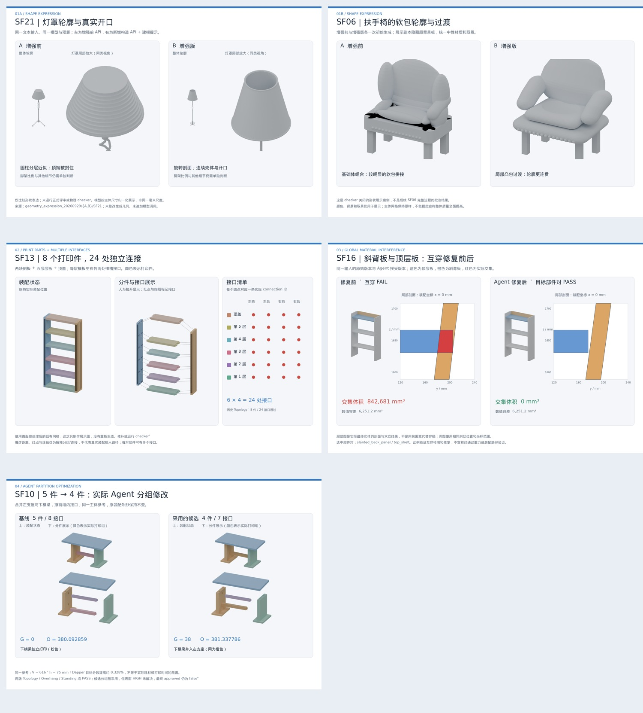

# 四组核心展示图与原始实验资源

2026-09-29。本目录包含 **四组、五张 2400×1600 PNG**（第一组 SF21 / SF06 各一张）、五页 PDF、原始资源与来源证据。全部来自已经完成的实验；本次只重渲染和排版，没有追加 Agent 候选、源码修复或 checker 测试。

## 展示图

| 组 | 图片 | 展示内容 |
|---|---|---|
| 1A | [SF21 灯罩形状对比](figures/01a_SF21_shape_comparison.png) | 左：增强前；右：新增 API + prompt。整体外形与灯罩局部，展示分层圆柱与旋转剖面的差异 |
| 1B | [SF06 扶手椅形状对比](figures/01b_SF06_shape_comparison.png) | 左：增强前；右：增强版。隐藏原背景板后展示软包轮廓；不修补原网格的接缝或其他缺陷 |
| 2 | [SF13 分件与多接口](figures/02_SF13_parts_and_interfaces.png) | 8 个真实打印件、24 处真实连接；装配图、着色爆炸图和接口清单 |
| 3 | [SF16 互穿修复前后](figures/03_SF16_interference_before_after.png) | 原始与 Agent 修复版本；实际实体的 x=0 mm 剖面，红色为真实交集 |
| 4 | [SF10 五件与四件](figures/04_SF10_five_to_four_parts.png) | 左：5 件 / 8 接口；右：4 件 / 7 接口，左支座与下横梁合并 |

[下载五页 PDF](figures/core_showcase.pdf) · [总览图](figures/overview.jpg)

## 资源与图的对应关系

- `resources/SF21/{A,B}/`、`resources/SF06/{A,B}/`：原始输入、plan、source、实际角色提示/输入/输出/工具记录、GLB、原始八视图、运行数据。A 为增强前本项目 master@8943a83，B 为增强分支当次生成；不是未修改官方上游的复现。
- `resources/SF13/`：微裂缝处理后的 8 件版本；源码、原始 manifest、STL/GLB、Topology 报告。
- `resources/SF16_before/`：原始 6 件书架；`resources/SF16_after/`：实际 Agent 第二次修补后被接受的 6 件版本。两者均包含绑定源码、原始 manifest、STL/GLB、Topology 报告。
- `resources/SF10_before/`：最新五件基线；`resources/SF10_after/`：本次实际 Engineering → Coder 合并产生的四件候选；源码、原始 manifest、STL/GLB、Topology / Overhang / Standing 报告。
- `evidence/SF10/`、`evidence/SF16/`：真实 Agent 调用和版本选择、评审、修补 diff、检查记录。`evidence/SF13/`：原始配置、计划与后续 standing 判据复核报告。`evidence/reports/`：项目原报告，保留其历史说明。
- `panels/`：本次展示使用的中性渲染与分件着色渲染，透明背景。
- `provenance.json`：每个装配版本的原始路径、source hash、manifest hash、打印件数与接口数。源码复制时逐一核对 manifest 中的 SHA256。
- `render_records.json`：本次相机、归一化及隐藏的背景节点。`sections.json`：SF16 实体剖面多边形与展示时复算的交集体积。`render_inputs.json`：装配边界、部件颜色及原报告中的目标 pair 行。
- `archive_manifest.json`：上传材料的逐文件 SHA256 与字节数。

原始日志/JSON 中的绝对路径保留，用于来源追溯；归档后的对应文件按上述相对目录读取。

## 图中结论的边界

**SF21 / SF06**：固定输入和预算的单次 A/B，所有正式评审与物理 checker 关闭。展示模型按主体尺寸归一化，不是相同毫米尺度。SF06 仅在渲染副本隐藏 presentation background；统一中性材质，既有主体几何不变。SF06 图来自形状展示实验，不来自后续未通过的完整工作流。

**SF13**：8 件 = 两侧板 + 五层层板 + 顶盖。每层横板左右各前后两个接口，6×4=24。爆炸位置、连接线与红点为解释标注，不能当作可执行的插入路径。历史微裂缝处理后 Topology 为 8/8 件、24/24 接口 PASS；本次没有重测。

**SF16**：目标 pair 为 `slanted_back_panel / top_shelf`，原报告交集体积 842681.3089759703 mm³，Agent 接受版本为 0。展示使用同一 x=0 mm 剖面、同一 y/z 坐标范围，红色区域来自实体求交，不是 AABB。展示复算分别为 842681.3089759687 和 0 mm³，与历史报告一致。正常数值容差在图中列出，不将此结果扩展为重力或装配路径验证。

**SF10**：同一主体 reference，V=616、h=75 mm。5 件基线 G=0、O=380.092859435526；4 件候选 G=38、O=381.337786213366，约 +0.328%。少一件与更多竖直空隙之间的目标函数权衡，不能表述为实测支撑耗材/时间减少。两版 Topology、Overhang、Standing 均 PASS，分组候选采用，但 surface HIGH 尚未满足，最终 approved=false。

## 制图方式

`prepare.py` 复制原资源，并使用保存的 print_transform_mm 的逆变换和 assembly_transform 将最终 STL 恢复到装配毫米坐标；`*.world.npz` 是此确定性坐标转换的展示数据。`render_panels.py` 用 Blender Cycles CPU 渲染既有网格，24 samples、900×760，统一灯光/相机。分组颜色只是展示标识，不是原材质。`sections.py` 用已有 Manifold 对真实实体取剖面。`compose.py` 将渲染及测量排成 PNG/PDF；未使用生成式图片工具改造几何。

启动这些脚本需安装原环境依赖，并将脚本顶部工作目录改为本地路径；不包含凭据或会话数据库。初次制图的曝光/字体显示问题已在最终面板中修正，没有改动实验源码或实验结果。
